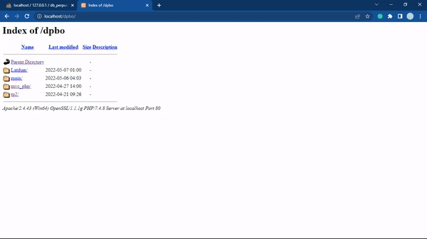
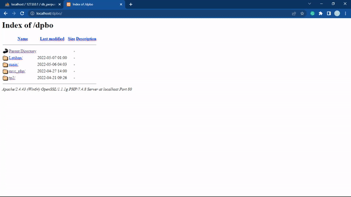

## LATIHAN11DPBO2022

Janji

>Saya Nelly Joy Christi Simanjuntak 2000199 mengerjakan Latihan 11 dalam mata kuliah Desain dan Pemrograman Berorientasi Objek untuk keberkahanNya maka saya tidak melakukan kecurangan seperti yang telah dispesifikasikan. Aamiin

#### TP2 - MVC (PHP)
Pada tugas ini terdapat source code PHP dan html beserta database. Berikut penjelasan mengenai apa yang telah saya kerjakan beserta dokumentasi hasilnya.

1. ## TP2DPBO2022

Janji

>Saya Nelly Joy Christi Simanjuntak 2000199 mengerjakan TUgas Praktikum 2 dalam mata kuliah Desain dan Pemrograman Berorientasi Objek untuk keberkahanNya maka saya tidak melakukan kecurangan seperti yang telah dispesifikasikan. Aamiin

#### TP2 - PHP GUI
Pada tugas ini terdapat source code PHP dan html beserta database yang telah saya buat. Berikut penjelasan mengenai apa yang telah saya kerjakan beserta dokumentasi hasilnya.

1. Tampilan awal dimana terdapat daftar kumpulan pengurus ormawa yang ditampilkan secara tersusun (logo dan navbar dapat diklik, semua item pada card/profil juga dapat di klik)  
    

2. Membuat fitur CRUD untuk data member untuk memanipulasi data
dari tabel member.  
   > Insert (Create)
   >  

   > Read (ada pada no.1)

   > Update
   >  

   > Delete
   >  
   
   
3. Buatlah fitur untuk peminjaman buku  
    
   

###### Sekian tugas saya, mohon maaf apabila masih terdapat banyak kesalahan atau kekurangan. Terima kasih.
