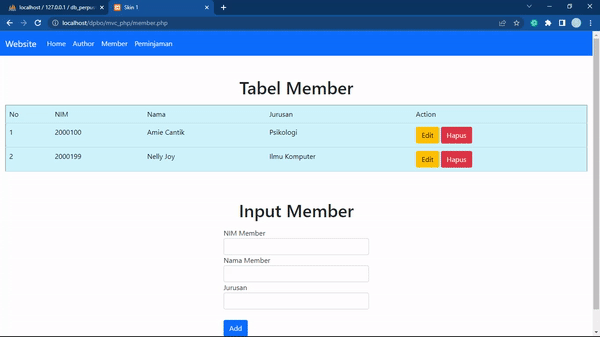
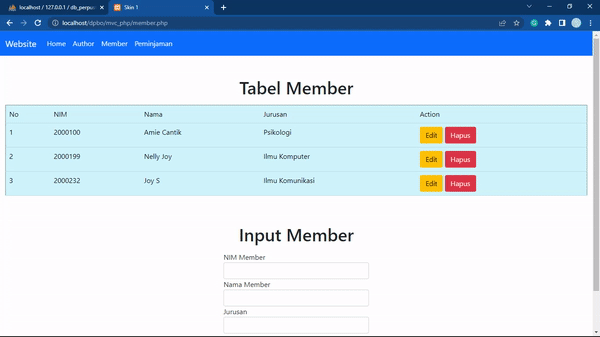
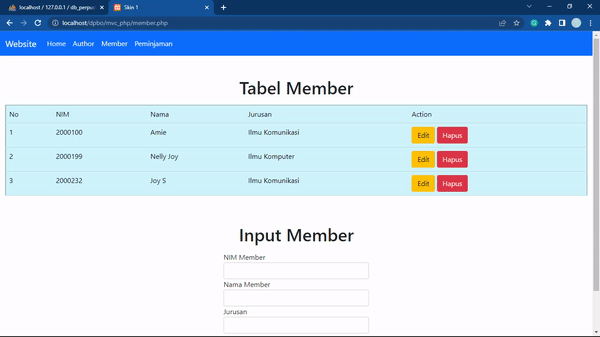

## LATIHAN11DPBO2022

Janji

>Saya Nelly Joy Christi Simanjuntak 2000199 mengerjakan Latihan 11 dalam mata kuliah Desain dan Pemrograman Berorientasi Objek untuk keberkahanNya maka saya tidak melakukan kecurangan seperti yang telah dispesifikasikan. Aamiin

#### TP2 - MVC (PHP)
Pada tugas ini terdapat source code PHP dan html beserta database. Berikut penjelasan mengenai apa yang telah saya kerjakan beserta dokumentasi hasilnya.

1. Membuat fitur untuk menampilkan data member menggunakan konsep MVC.  
    

2. Membuat fitur CRUD untuk data member untuk memanipulasi data dari tabel member.  
   > Create (Insert)  
   >  

   > Read (ada pada no.1), data member berhasil ditampilkan

   > Update - Ketika update data member, NIM tidak dapat diubah  
   >  

   > Delete  
   >  
   
   
3. Membuat fitur untuk peminjaman buku. Saat menambahkan peminjaman, status buku ialah belum dikembalikan. Terdapat button kembalikan untuk mengubah status buku.  
    
   

###### Sekian tugas saya, mohon maaf apabila masih terdapat banyak kesalahan atau kekurangan. Terima kasih.
